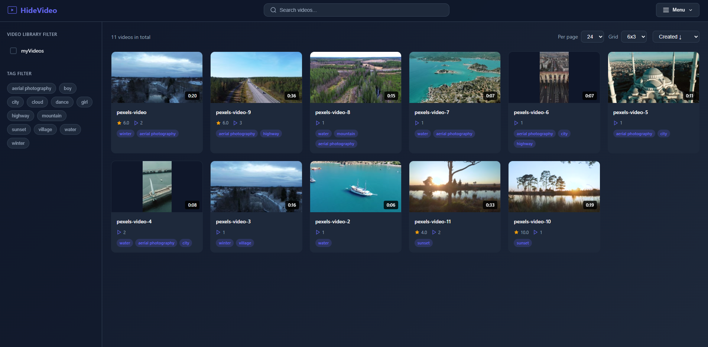
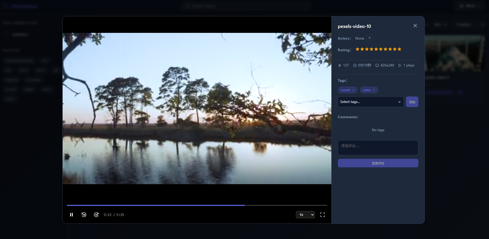
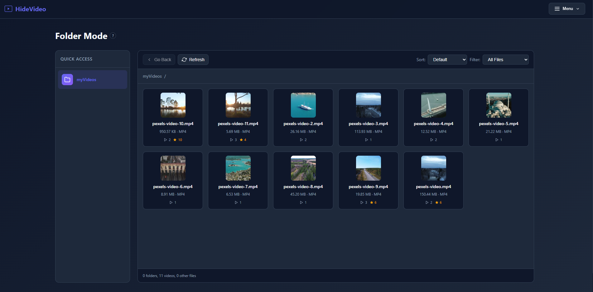
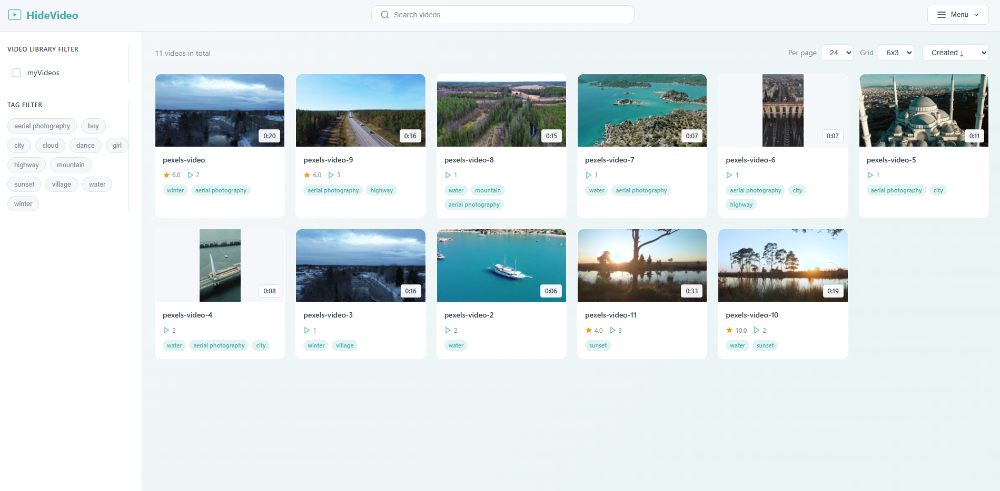

[中文](README-zh.md) | [English](README.md) 

# HideVideo - Personal Lightweight Video Management

HideVideo is a personal lightweight video management system . (个人轻量视频库管理系统) 
Built with Go + Gin + GORM + SQLite + Vue3.

<table style="width: 100%;">
  <tr>
    <td></td>
    <td></td>
  </tr>
  <tr>
    <td></td>
    <td></td>
  </tr>
</table>


## Tech Stack

- **Backend**: Go, Gin, GORM, SQLite
- **Frontend**: Vue3, Pinia, Vue Router, Axios
- **Video Processing**: FFmpeg

## Features

1. **User Authentication** - Login/logout with admin and member roles
2. **Video Library Management** - Add/remove local video libraries, scan videos, generate covers
3. **Folder Mode** - Browse video hierarchy like a local file manager
4. **Tag Management** - Multi-tag filtering, tag reordering
5. **Actor Management** - Actor library management, link videos, view actor filmography
6. **Sorting** - Sort by creation time, play count, rating, or random
7. **Search** - Search by tag/video name/video ID
8. **Video Display** - Pagination, grid configuration (3x4, 4x3, 5x3, 6x3)
9. **Video Playback** - Popup player, seek, playback speed, fullscreen, click to play/pause
10. **Rating & Comments** - 10-point rating system, comment functionality
11. **Icon Generation** - Auto-generate video icons
12. **User Management** (admin only) - Add/delete users
13. **Settings Page** - Basic settings, security settings (change password)
14. **Preference Persistence** - Home sorting, items per page, grid columns, tag columns auto-saved
15. **Video Streaming** - Public access, no login required
16. **Clean Invalid Indexes** - Clean up database indexes for deleted videos

## Project Structure

```
HideVideo/
├── backend/           # Go backend
│   ├── main.go       # Entry point
│   ├── config/       # Configuration
│   ├── models/       # Data models
│   ├── handlers/     # API handlers
│   ├── database/     # Database operations
│   └── utils/        # Utilities (FFmpeg)
├── frontend/         # Vue3 frontend
│   ├── src/
│   │   ├── views/   # Pages (Home, Login, Libraries, FileManager, Settings, ActorVideos)
│   │   ├── components/ # Components (TopNav, VideoPlayer, AppFooter)
│   │   ├── stores/  # State management (auth, video)
│   │   ├── api/     # API calls
│   │   └── router/  # Router configuration
│   └── package.json
└── data/             # Data directory (SQLite database, covers, icons)
```

## Quick Start

### Prerequisites

1. **Go** 1.18+
2. **Node.js** 18+ (for frontend)
3. **FFmpeg** (for video processing and cover generation)
4. **FFprobe** (for video info parsing)

### Installation

#### 1. Docker (Recommended)

```bash
# Create data directory
mkdir -p ./data

# Start container
docker run -d \
  -v $(pwd)/data:/app/data \
  -p 49377:49377 \
  --name hidevideo \
  --restart unless-stopped \
  pureages/hidevideo:latest
```

FFmpeg must be installed on the host machine and mounted into the container:

```bash
docker run -d \
  -v $(pwd)/data:/app/data \
  -v /usr/bin/ffmpeg:/usr/bin/ffmpeg:ro \
  -v /usr/bin/ffprobe:/usr/bin/ffprobe:ro \
  -p 49377:49377 \
  --name hidevideo \
  --restart unless-stopped \
  pureages/hidevideo:latest
```

#### 2. Local Deployment

##### Clone Project

```bash
git clone https://github.com/pureages/HideVideo.git
cd HideVideo
```

##### Start Backend

```bash
cd backend
go mod tidy
go run main.go
```

Backend will start at http://localhost:49377

### Access the System

Open browser to http://localhost:49377 (or: `<your-server-ip>:49377`)

Default admin account:
- Username: admin
- Password: admin123

## Configuration

### Backend Configuration

Modify `backend/config/config.go`:

- `ServerConfig.Port`: Server port (default 49377)
- `DatabaseConfig.Path`: Database file path (default ./data/hidevideo.db)
- `ServerConfig.StaticPath`: Cover storage path (default ./data/covers)
- `ServerConfig.UploadPath`: Video file path (default ./data)

### Frontend Configuration

Modify `frontend/vite.config.js`:

- `server.port`: Frontend port (default 49378)
- `server.allowedHosts`: Allowed hosts (for reverse proxy)

## User Roles

- **Admin**: Can manage users
- **Member**: Can only modify their own username and password

## API Endpoints

### Authentication
- `POST /api/auth/login` - Login
- `POST /api/auth/logout` - Logout
- `GET /api/auth/check` - Check login status

### Video Library
- `GET /api/libraries` - Get video library list
- `POST /api/libraries` - Add video library
- `DELETE /api/libraries/:id` - Delete video library
- `POST /api/libraries/:id/scan` - Scan video library
- `POST /api/libraries/:id/cover` - Generate covers
- `POST /api/libraries/:id/icon` - Generate icons
- `POST /api/libraries/clean-invalid` - Clean invalid indexes
- `GET /api/libraries/:id/files` - Get library file list
- `GET /api/libraries/:id/path` - Get library path

### Videos
- `GET /api/videos` - Get video list
- `GET /api/videos/folders` - Get folder tree
- `GET /api/videos/by-path` - Get videos by path
- `GET /api/videos/:id` - Get video details
- `GET /videos/:id/stream` - Video streaming
- `PUT /api/videos/:id/rating` - Update rating
- `PUT /api/videos/:id/filename` - Rename video
- `POST /api/videos/:id/play` - Increment play count
- `DELETE /api/videos/:id` - Delete video

### Video Tags
- `GET /api/videos/:id/tags` - Get video tags
- `POST /api/videos/:id/tags` - Add video tag
- `DELETE /api/videos/:id/tags/:tagId` - Remove video tag

### Video Actors
- `GET /api/videos/:id/actors` - Get video actors
- `POST /api/videos/:id/actors` - Add video actor
- `DELETE /api/videos/:id/actors/:actorId` - Remove video actor

### Comments
- `GET /api/videos/:id/comments` - Get comments
- `POST /api/videos/:id/comments` - Add comment
- `DELETE /api/comments/:id` - Delete comment

### Tags (Admin Only)
- `GET /api/tags` - Get tag list
- `POST /api/tags` - Add tag
- `PUT /api/tags/reorder` - Reorder tags
- `PUT /api/tags/:id` - Update tag
- `DELETE /api/tags/:id` - Delete tag

### Actors (Admin Only)
- `GET /api/actors` - Get actor list
- `POST /api/actors` - Add actor
- `PUT /api/actors/reorder` - Reorder actors
- `PUT /api/actors/:id` - Update actor
- `DELETE /api/actors/:id` - Delete actor
- `GET /api/actors/:id/videos` - Get actor's videos

### User Management (Admin Only)
- `GET /api/users` - Get user list
- `POST /api/users` - Add user
- `DELETE /api/users/:id` - Delete user
- `PUT /api/users/:id/password` - Admin change user password
- `PUT /api/users/:id/info` - Admin change user info
- `PUT /api/users/password` - User change own password
- `PUT /api/users/info` - User change own info
- `GET /api/users/me` - Get current user info

## License

MIT License

## GitHub

https://github.com/pureages/HideVideo
